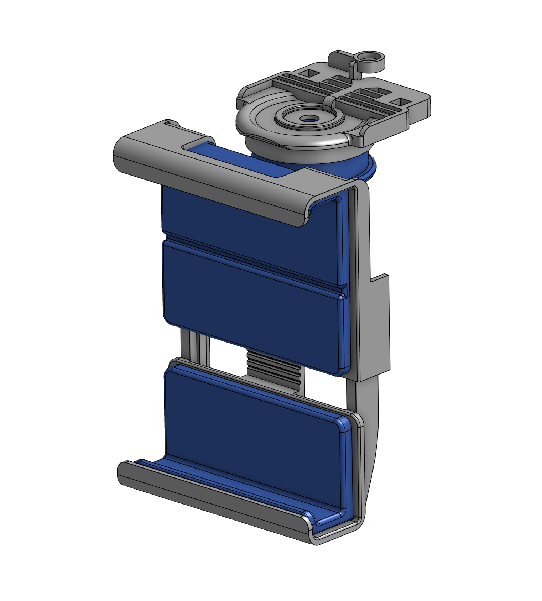
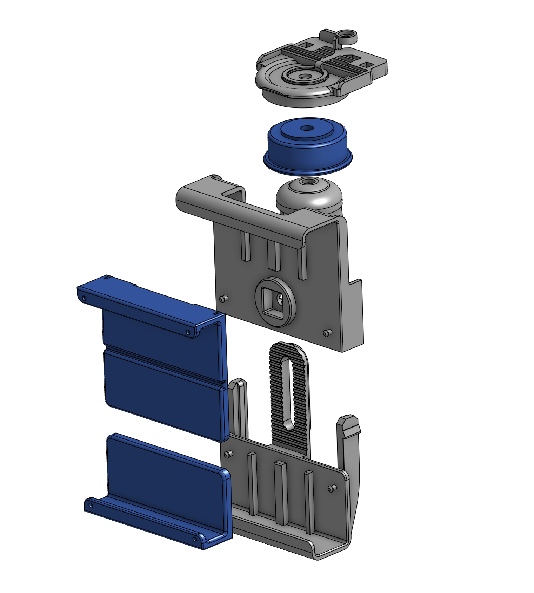

# Hardware Setup Guide

The SkyMapper system is built entirely using off-the-shelf consumer hardware. This approach ensures high accessibility and low cost while maintaining high-fidelity 3D reconstruction capabilities without the need for expensive LiDAR sensors.

---

## 🚁 1. Commercial UAV Requirements
We utilize standard commercial drones to eliminate the need for expensive, custom-built aerial platforms.

* **Recommended Drone:** DJI Phantom 4 Pro V2.0 (or equivalent commercial models supporting developer SDKs).
* **Payload Capacity:** Must be able to comfortably carry an additional payload of approximately 200-250g (smartphone + mount) without compromising flight stability or battery life significantly.
* **Communication:** Reliable radio link for sending closed-loop control commands from the ground station or flight controller.

## 📱 2. Smartphone Requirements
The smartphone acts as the primary sensor payload, leveraging its built-in cameras, IMU, and advanced processing power.

* **Minimum Specs:** A modern smartphone with robust Vision-Inertial Odometry (VIO) capabilities (e.g., iOS devices with ARKit or Android devices with ARCore).
* **Core Role:** 1. Captures high-resolution images for photogrammetry.
    2. Estimates real-time 6DoF (Degrees of Freedom) pose without drift.
    3. Transmits synchronized pose and image data to the web server.

---

## 🔧 3. Custom 3D-Printed Mount Design
To securely attach the smartphone to the UAV without interfering with its native sensors, we designed a custom, lightweight 3D-printed mount. Below are the structural designs modeled in OnShape.

<figure style="margin: 0; flex: 1; text-align: center;" markdown="1">

{ style="border-radius: 8px; box-shadow: 0 4px 8px rgba(0,0,0,0.3); width: 100%; object-fit: cover;" }

<figcaption style="color: #a0a0a0; font-size: 0.9em; margin-top: 10px;">
  <b>Figure 1a:</b> 3D CAD model of the mount structure
</figcaption>

</figure>

<figure style="margin: 0; flex: 1; text-align: center;" markdown="1">

{ style="border-radius: 8px; box-shadow: 0 4px 8px rgba(0,0,0,0.3); width: 100%; object-fit: cover;" }

<figcaption style="color: #a0a0a0; font-size: 0.9em; margin-top: 10px;">
  <b>Figure 1b:</b> Detailed view of the smartphone holder
</figcaption>

</figure>

!!! info "Material Recommendation"
    We strongly recommend using **PETG** or **ABS** over standard PLA. These materials offer a better balance of flexibility and thermal resistance, which is crucial for outdoor flights and reducing motor vibrations.

---

## 🧩 4. Final Integration & Assembly
The core of our system is the seamless physical integration of the commercial UAV and the smartphone using the printed mount. The design focuses on minimal weight addition, secure attachment, and an unobstructed field of view (FOV).

<figure style="margin: 40px 0; text-align: center;" markdown="1">
  { style="border-radius: 10px; box-shadow: 0 8px 16px rgba(0,0,0,0.5); width: 100%; max-width: 600px; display: block; margin: 0 auto;" }
  <figcaption style="color: #a0a0a0; font-size: 0.95em; margin-top: 15px;">
    <b>Figure 2:</b> Final assembled hardware configuration showing the commercial UAV carrying the smartphone payload.
  </figcaption>
</figure>

### Assembly Steps:
1. **Print the Parts:** Print the top and bottom brackets using the provided `.stl` files located in the `hardware/3d_models` directory of our GitHub repository.
2. **Attach to UAV:** Secure the brackets around the drone's landing gear. Ensure they are tightly fastened to prevent any mid-flight shifting.
3. **Insert Smartphone:** Slide the smartphone into the holder. **Crucial:** Verify that the camera lens and IMU are completely clear of any physical obstructions (like the drone's propellers or legs).
4. **Final Check:** Shake the drone gently to ensure the mount is rigid and the smartphone does not rattle.