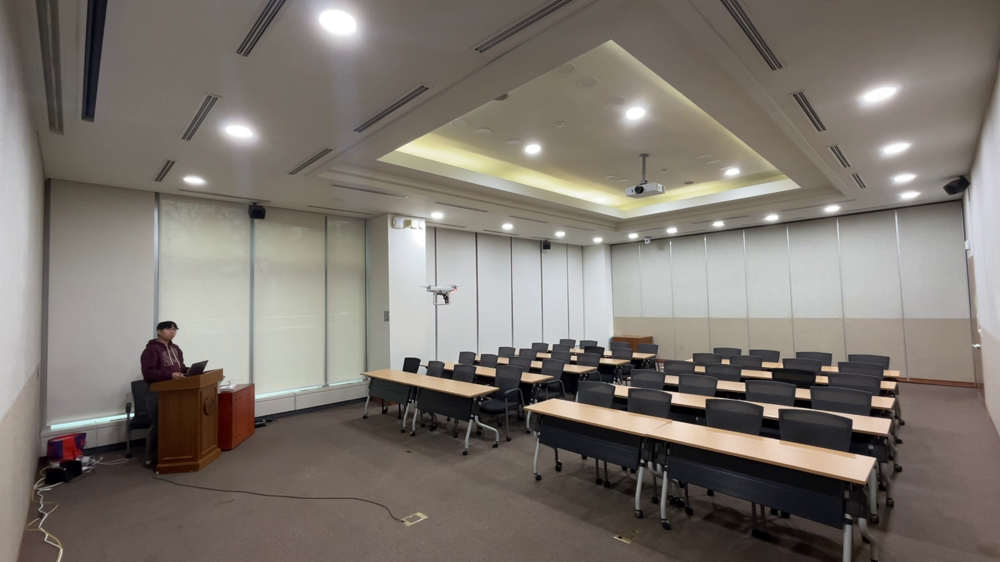
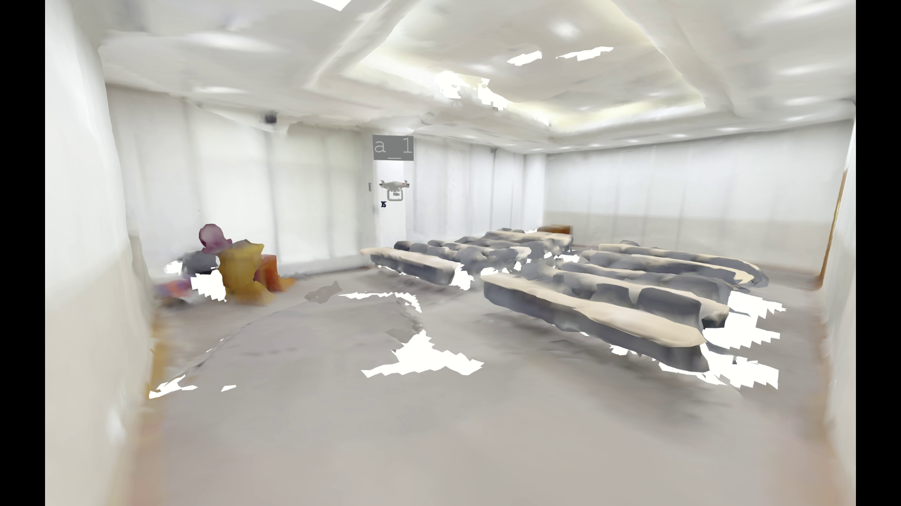

# 🚀 Getting Started with SkyMapper

Welcome to the official documentation for **SkyMapper**. 

SkyMapper is an open-source framework designed to transform off-the-shelf commercial UAVs (drones) and smartphones into a fully autonomous, high-fidelity 3D reconstruction system. This guide will walk you through building, deploying, and flying your own SkyMapper system.

---

## 🎯 System Overview

To build this system, it is important to understand how the components interact. Our architecture relies on a **closed-loop pipeline** between the edge (smartphone/drone) and the cloud (web server).

{ style="max-width: 100%; border-radius: 8px; box-shadow: 0 4px 8px rgba(0,0,0,0.3); display: block; margin: 30px auto;" }

<em>Figure 1: SkyMapper Hardware and Network Architecture</em>

The framework is divided into three major operational nodes:
1. **Mobile Node (Smartphone):** Runs the VIO tracking and captures high-resolution images.
2. **Server Node (Web Server):** Computes the Next-Best-View (NBV) and handles the 3D reconstruction pipeline.
3. **Drone Node (Flight Controller):** Executes autonomous flight waypoints generated by the server.

---

## 🌟 What You Can Achieve

By following our open-source guide, you can easily deploy a drone to autonomously scan an indoor space and generate high-fidelity 3D models with 7-12cm accuracy.

  

{ style="width: 100%; border-radius: 8px;" }
<h3 style="margin-top: 15px; color: #fff;">Real Environment</h3>
    
Standard indoor space targeted for autonomous drone scanning.

  

  
  

    { style="width: 100%; border-radius: 8px;" }
    <h3 style="margin-top: 15px; color: #fff;">3D Reconstruction</h3>
    
Dense point cloud and 3D mesh automatically generated by SkyMapper.

  

---

## 📋 Prerequisites

Before diving into the setup, please ensure you have the following requirements ready:

### 🛠️ Hardware Requirements
* **Commercial Drone:** DJI Phantom 4 Pro V2.0 (or similar DJI SDK-supported drones).
* **Smartphone:** iOS device with ARKit support or Android device with ARCore support.
* **3D Printer:** Required to print the custom smartphone mount (PLA, ABS, or PETG).

### 💻 Software Requirements
* **Development PC / Server:** Linux (Ubuntu 20.04+) or cloud instance (AWS/GCP) for hosting the web server.
* **Python Environment:** Python 3.8+ for running server scripts and NBV algorithms.
* **Drone SDK:** DJI Mobile SDK (if you plan to compile the drone controller app from scratch).

---

## 🗺️ How to Use This Guide

This documentation is structured sequentially. We highly recommend completing the **Hardware Setup** before moving on to the **Software Pipeline**.

  <ul>
    <li>
      <a href="hardware.html">
        <strong>1. Hardware Setup ➔</strong>
        
Learn how to 3D print the mount, assemble the payload, and integrate the smartphone with the drone.

      </a>
    </li>
    <li>
      <a href="software.html">
        <strong>2. Software Pipeline ➔</strong>
        
Set up the web server, deploy the mobile tracking app, and configure the autonomous flight controller.

      </a>
    </li>
  </ul>

