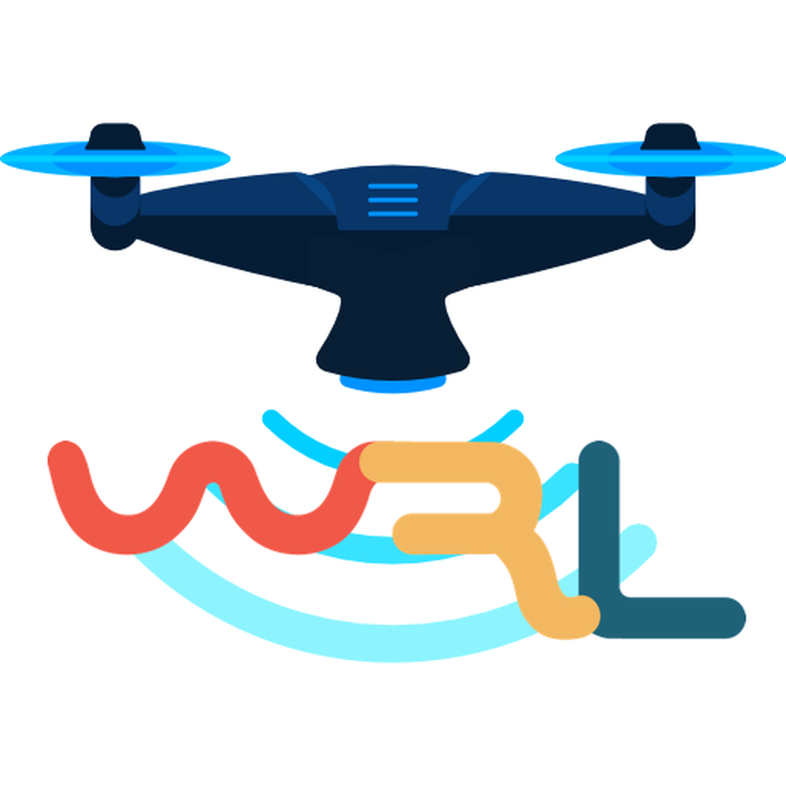
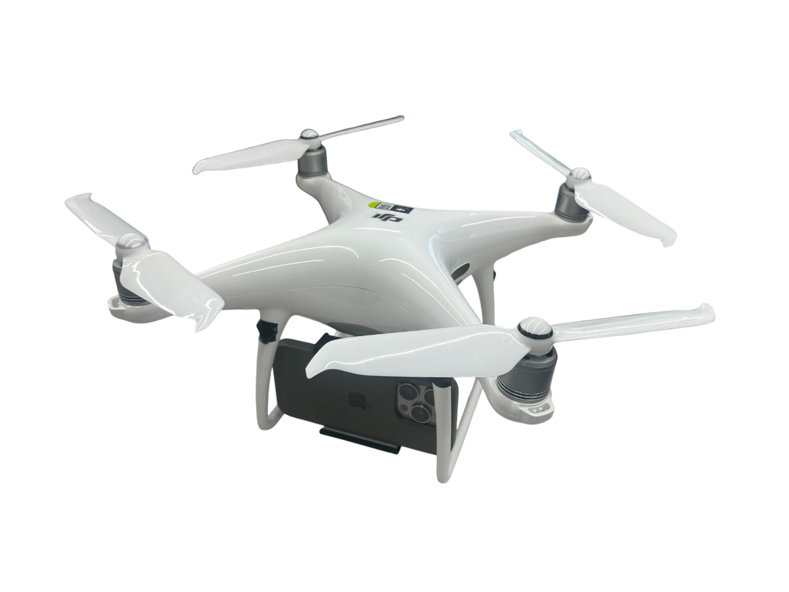
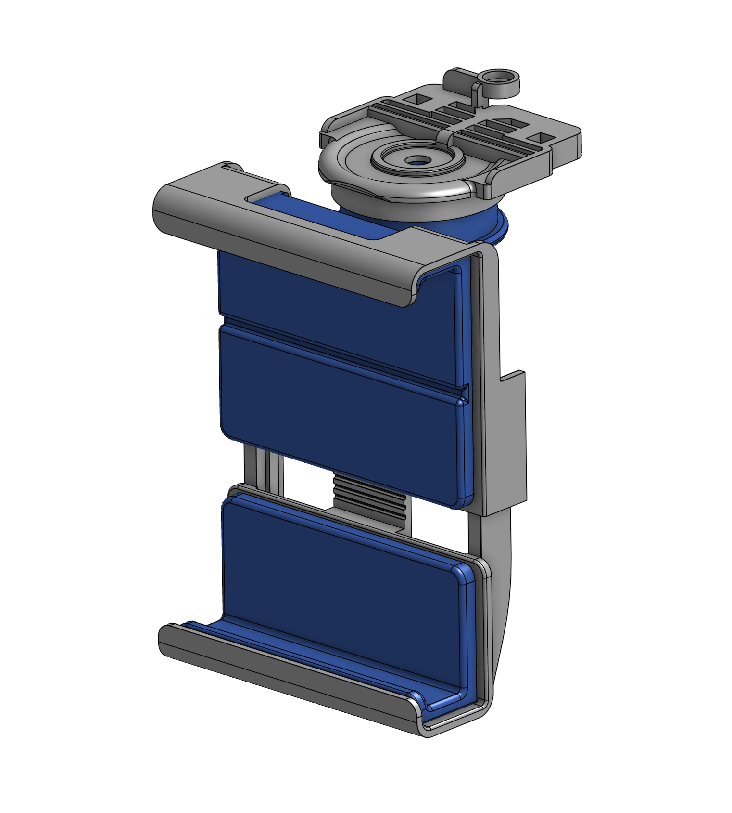

---
hide:
  - toc
---

<style>
  .hero-container {
    position: relative;
    width: 100%;          /* 100vw 전체화면 강제를 풀고 본문 너비에 맞춤 */
    height: 60vh;         /* 높이를 살짝 줄여서 메뉴나 다른 내용이 한눈에 보이게 함 */
    border-radius: 20px;  /* 모서리를 둥글게 깎아서 매우 세련된 쇼케이스 배너 느낌을 줌 */
    display: flex;
    flex-direction: column;
    align-items: center;
    justify-content: center;
    overflow: hidden;
    background-color: #000;
    box-shadow: 0 15px 35px rgba(0,0,0,0.4); /* 깊이감 있는 그림자 추가 */
    margin-bottom: 40px;  /* 비디오 아래쪽 여백 */
  }

  .bg-video {
    position: absolute;
    top: 50%;
    left: 50%;
    min-width: 100%;
    min-height: 100%;
    width: auto;
    height: auto;
    z-index: 0;
    transform: translateX(-50%) translateY(-50%);
    object-fit: cover;
    opacity: 0.35; 
  }

  .hero-content {
    position: relative;
    z-index: 1;
    text-align: center;
    color: white;
    padding: 20px;
  }

  .hero-content img {
    width: 150px;
    margin-bottom: 20px;
    filter: drop-shadow(0px 4px 6px rgba(0,0,0,0.5));
  }

  .hero-content h1 {
    font-size: 4rem;
    font-weight: 900;
    margin: 0;
    color: white !important;
    text-shadow: 2px 2px 8px rgba(0,0,0,0.8);
  }

  .hero-content p {
    font-size: 1.2rem;
    max-width: 800px;
    margin: 15px auto 30px auto;
    color: #e0e0e0;
    text-shadow: 1px 1px 4px rgba(0,0,0,0.8);
  }

  .hardware-grid {
    display: flex;
    gap: 30px;
    margin-top: 20px;
    justify-content: center;
  }
  .hardware-item {
    flex: 1;
    max-width: 400px;
    text-align: center;
  }
  .hardware-item img {
    width: 100%;
    height: 300px; /* 두 사진의 높이를 동일하게 고정 */
    object-fit: cover; /* 비율을 유지하면서 빈 공간 없이 꽉 채움 (넘치는 부분은 잘림) */
    border-radius: 12px;
    box-shadow: 0 4px 10px rgba(0,0,0,0.15);
    margin-bottom: 15px;
    transition: transform 0.3s ease;
  }
  .hardware-item img:hover {
    transform: scale(1.03); 
  }
</style>

<div class="hero-container">
  <video class="bg-video" autoplay loop muted playsinline>
    <source src="assets/Scan_MeetingRoom2_WXR.mp4" type="video/mp4">
  </video>

  <div class="hero-content">
    
    <h1>SkyMapper</h1>
    <p><b>Commercial UAV-Smart Phone Integration for Low-Cost 3D Reconstruction with Targeted Remote Monitoring</b></p>
    
    <div>
      <a href="guide/index.html" class="md-button md-button--primary" style="font-size: 1.1rem; padding: 10px 20px;">🚀 Get Started</a>
      <a href="https://github.com/..." target="_blank" class="md-button" style="font-size: 1.1rem; padding: 10px 20px; color: white; border-color: white;">💻 View on GitHub</a>
    </div>
  </div>
</div>

<br><br>

## 🚁 Hardware Overview
Our system is designed with accessibility in mind, utilizing off-the-shelf commercial drones and standard smartphones. 

<div class="hardware-grid">
  <div class="hardware-item">
    
    <h3>Commercial UAV Integration</h3>
    <p>We leverage a standard DJI drone, removing the need for expensive custom aerial platforms. This ensures high mobility and ease of deployment.</p>
  </div>
  <div class="hardware-item">
    
    <h3>Custom Smartphone Mount</h3>
    <p>A lightweight, 3D-printed mounting system securely integrates the smartphone's processing power and camera with the drone's flight capabilities.</p>
  </div>
</div>

<div align="center" style="margin-top: 20px;">
  <a href="guide/hardware.html" class="md-button">View Detailed Assembly Guide ➔</a>
</div>

<br><br>

## 📖 Abstract
The integration of mobile devices and commercial UAVs offers a cost-effective solution for 3D reconstruction and targeted remote monitoring. This project validates consumer smartphone-UAV integration for fully autonomous indoor scanning with closed-loop control, achieving 7-12cm reconstruction accuracy and 72-99% coverage across real indoor environments. We provide a complete, reproducible system using off-the-shelf components along with open-source software.

<br>

## 📌 Project Highlights
* **Low-cost Hardware Setup:** Efficient data acquisition combining a standard mobile phone and a commercial drone.
* **Autonomous Scanning:** Real-time data collection via autonomous monitoring in unknown environments.
* **Web-based Archiving:** Web server-based data archiving enabling diverse downstream applications.
* **High Fidelity:** Drift-free trajectory estimation and efficient online reconstruction.

<br>

## 📝 Citation
If you find this project useful for your research, please consider citing:
```bibtex
@article{park2025skymapper,
  title={Commercial UAV-Smart Phone Integration for Low-Cost 3D Reconstruction with Targeted Remote Monitoring},
  author={Park, Nojin and Seo, Ji Hyun and Yoo, Byounghyun},
  journal={TBD},
  year={2025}
}